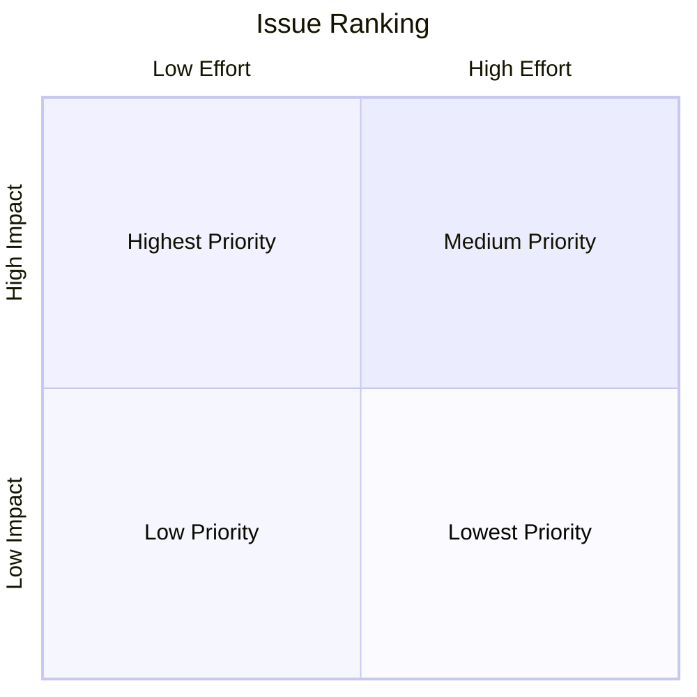

# Contributing

🤝 All contributions are welcome

## Reporting an issue

If you encounter a bug or unexpected behavior when using this package please [create an issue](https://github.com/mharrisb1/openai-responses-python/issues) and prefix the issue title with `bug:` and add the <span style='background-color: red; padding: 2px; border-radius: 5px'>bug</span> label.

Example title:

```
bug: lorem ipsum
```

## Requesting a feature

The main goal of this project is to provide automatic mocking for _all_ of the OpenAI API endpoints. If an endpoint or specific feature/behavior of an endpoint is currently not supported, chances are that it's already on the [roadmap](#roadmap). If you don't find the feature you need already in the issues please add a new issue and prefix the title with `feat:` and add the <span style='background-color: blue; padding: 2px; border-radius: 5px'>enhancement</span> label.

Example title:

```
feat: lorem ipsum
```

## Roadmap

The roadmap is just a ranking of the currently open issues and no hard dates are set at this point for any fix or new feature.

I have added version release milestones to some of the issues to give a sense of what is coming in what order. View milestones [here](https://github.com/mharrisb1/openai-responses-python/milestones).

I (Michael) am the BDFL of the project and can and will arbitrarily rank issues according to my own needs (and those of my [employer](https://www.definite.app)) but for the most part I try to evaluate priority of issues based on a 2-dimensional system that looks at **_effort_** and **_impact_**.

- _Effort_ is a rough estimate of whether something will take a lot of work, some work, or little work to implement
- _Impact_ is a rough estimate of how important something is

Both are unscientific and flawed but they allow me to try to focus on what to work on when.

If you look at the [project's issues](https://github.com/mharrisb1/openai-responses-python/issues), you'll see they are labeled with some non-standard issue labels.

| Label                                                                                | Description   |
| ------------------------------------------------------------------------------------ | ------------- |
| <span style='background-color: green; padding: 2px; border-radius: 5px'>e0 🌵</span>  | Low effort    |
| <span style='background-color: yellow; padding: 2px; border-radius: 5px'>e1 ⚡️</span> | Medium effort |
| <span style='background-color: red; padding: 2px; border-radius: 5px'>e2 🔥</span>    | High effort   |
| <span style='background-color: green; padding: 2px; border-radius: 5px'>i0 🌵</span>  | Low impact    |
| <span style='background-color: yellow; padding: 2px; border-radius: 5px'>i1 ⚡️</span> | Medium impact |
| <span style='background-color: red; padding: 2px; border-radius: 5px'>i2 🔥</span>    | High impact   |

Ranking is evaluated according to this quadrant where the priority is ordered from top to bottom and left to right.



View ranked [open issues](https://github.com/users/mharrisb1/projects/4) and [in progress](https://github.com/users/mharrisb1/projects/4/views/2) issues.

## Setting up development environment

This project uses [Poetry](https://python-poetry.org/) to manage the Python environment, [Black](https://github.com/psf/black) to format code,
and [mypy](https://mypy-lang.org/) to run static analysis. Please make sure your environment is setup with these enabled.

To make sure everything is working correctly, make sure you have Poetry installed, then install the dependencies, and then run [tox](https://tox.wiki/en/4.14.2/).

```sh
pipx install poetry==1.8                    # if not already installed
poetry config virtualenvs.in-project true   # recommended
poetry install --with dev                   # install deps including development deps
poetry shell                                # activate venv
tox run                                     # run lint, static analysis, unit tests, and examples
```
